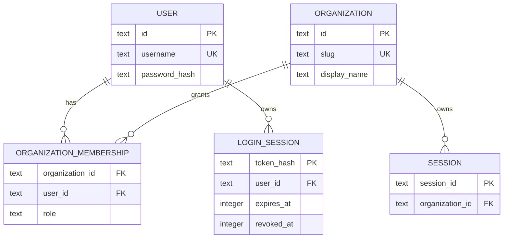

# ADR 0010: Axis authentication and client connection ownership

- Status: Accepted
- Date: 2026-07-10
- Relates to: ADR 0005 (organization ownership), ADR 0008 (Axis/Orbit split)

> **Amended by ADR 0024 (2026-07-17).** `~/.stellarc/auth.sqlite` remains the
> transactional authority for Axis users, memberships, roles, and login
> sessions. It may store external connection/credential metadata, grants,
> revocation, and audit references, but not external secret payloads. Encrypted
> payloads live in the separate Secret Store and are usable only through the
> Auth Broker. Installed-client refresh credentials remain in the client's OS
> credential store as specified below.

## Context

Stellarc currently protects every API request with one installation-wide bearer token compiled into the Web UI. It has a hard-coded `default` organization and no user, membership, login-session, or client-connection model. This is sufficient for a loopback prototype but cannot safely support a remotely served Axis or multiple organizations.

The Web UI and installed clients have different connection boundaries. A Web UI is served by one Axis and must not become an arbitrary Axis client. A desktop or mobile installation must be able to retain independent authenticated connections to multiple Axiss.

## Doctrine

**A Axis owns its users, organizations, memberships, nodes, and resources; installed clients own a list of Axis connections, while a Web UI is permanently scoped to the Axis that served it.**

## Decision

### Axis-owned identity and authorization

Each Axis owns:

- local user accounts and password hashes;
- organizations and immutable organization slugs;
- user membership and organization roles;
- revocable login sessions;
- organization-scoped Orbit registrations and resources.

There is no global Stellarc account, cross-Axis session, or organization spanning multiple Axiss in v1.

The Axis identity and authorization store is `~/.stellarc/auth.sqlite`. It is operational/security truth, separate from the business event log: password hashes and revocable login-session records are not replayable domain events and must not be copied into projections or search. Organization resource records remain Axis business truth and follow ADR 0005. External secret payloads are governed separately by ADR 0024.

The existing installation bearer token remains supported for native/operator automation and migration. Browser login uses an opaque random session token in an HttpOnly cookie; only a BLAKE3 hash is persisted. Passwords use Argon2id.

Every organization-scoped request identifies its organization explicitly. Axis derives authorization from the authenticated principal's membership; a client-selected organization is context, never authority.

### Sources of truth and ERD

`auth.sqlite` is authoritative for security identity and authorization relationships. The append-only Axis event log is authoritative for resource ownership; in this delivery that means `SessionCreated` followed in the same batch by `SessionOrganizationAssigned`. The session projection joins those events into `SessionRow.org_id`. Browser selection is disposable client state and is never a source of authorization truth.

Organizations and memberships intentionally remain in the transactional security store for v1. They are durable Axis business authorization truth, but not replayed into the general search/read projections. Any later move into domain events requires a migration ADR and must preserve the security store as a fail-closed authorization index during transition.

### Web UI

- Axis identity and URL come from the document origin.
- The Web UI has no add-Axis or edit-Axis-URL flow.
- It authenticates with a Axis-issued HttpOnly cookie.
- It lists only the organizations available to the authenticated user.
- The selected organization is URL/local UI context and is sent on API requests; Axis validates membership.
- Logout revokes only the current Axis session.

### Desktop and mobile

An installed client owns local `AxisConnection` records containing Axis URL, pinned Axis identity, account display information, selected organization, and a reference to an encrypted refresh credential. Secrets live in the operating-system credential store, not ordinary app configuration.

Installed clients may retain several Axis connections and switch among them. Authentication, organization selection, and logout are independent per Axis. An installed client is not an Orbit merely because it connects to a Axis.

No desktop/mobile application exists in this repository today. This ADR defines its boundary; implementation begins when that client scaffold exists.

## Security rules

- Fail closed on invalid or expired sessions and non-member organization selection.
- Usernames and organization slugs are unique within one Axis, not globally.
- Login errors do not distinguish unknown users from wrong passwords.
- Session cookies are HttpOnly and SameSite=Strict; Secure is enabled for HTTPS deployments.
- Browser requests require the exact serving origin (scheme, host, and effective port), or an explicitly configured exact development/reverse-proxy origin. Cookie requests without Origin require same-origin Fetch Metadata; valid native bearer credentials may omit Origin.
- Orbit Iroh identity remains distinct from user and client-installation identity.

## Initial provisioning

A Axis may bootstrap one administrator from `STELLARC_ADMIN_USERNAME` and `STELLARC_ADMIN_PASSWORD` when its user table is empty. The password is consumed at startup and never persisted in plaintext. Without bootstrap credentials, installation-token access remains available but password login fails closed until an administrator is provisioned.

## Consequences

- Remote Web UI access no longer requires embedding the installation token in JavaScript.
- Installed clients can later support several Axiss without weakening the Web UI origin boundary.
- New browser-created sessions are atomically assigned to the selected organization in the event log; scoped reads, mutations, forks, subsessions, handovers, and WebSocket frames enforce that ownership. Session workspaces are rooted under the durable organization ID. Legacy imported sessions remain `personal` until an explicit migration assigns them.
- Vault files are rooted under the durable organization ID and Vault routes select that filesystem partition from the authenticated organization scope. Legacy installation-token Vault routes remain available against the configured legacy/default organization root during migration.
- Resource classes that do not yet carry durable organization ownership are not registered in the organization-scoped router. Legacy installation-token routes remain available for migration, but membership authorization alone is never presented as tenant isolation.
- The Web UI exposes organization-owned Sessions and Vaults. It hides unsupported Project and Fleet navigation and shows a fail-closed unavailable state for direct legacy links until those resources gain durable ownership.
- Authentication data has a narrow, auditable persistence boundary rather than contaminating the event log with secrets.
