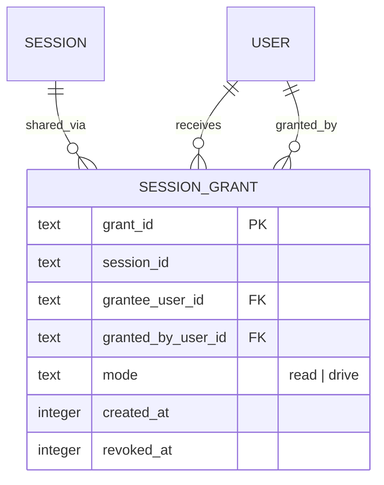
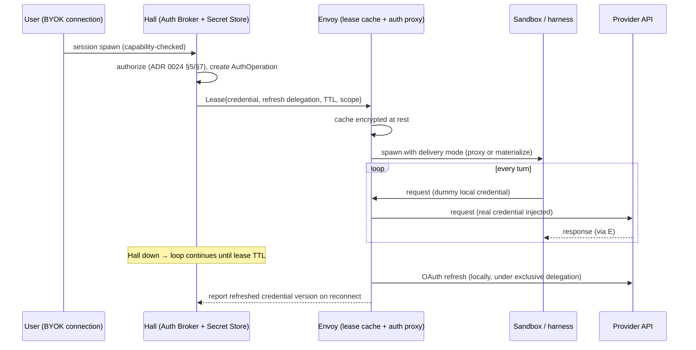

# ADR 0027 — Session Sharing, Multi-User Attribution, and the Execution/Auth Matrix

- Status: Accepted
- Date: 2026-07-18
- Amends: ADR 0024 (adds offline lease continuity and per-harness credential
  delivery modes to the Auth Broker), ADR 0004 (adds mandatory signed
  provenance to vault writes)
- Relates to: ADR 0005 (org boundary), ADR 0006 (setup adapters / declarative
  replication), ADR 0008 (Hall/Envoy split), ADR 0010 (Hall-owned identity, no
  cross-Hall session in v1), ADR 0016 (vault sync), ADR 0017 (session cutover)

## 1. Context

Olympus is the self-hosted gateway a team runs its agent orchestration
through. That thesis requires three things the current architecture does not
yet define:

1. **Sharing.** Users must be able to share sessions with teammates, keep
   team-wide vaults, and move sessions between Halls (a team Hall and
   per-person local Halls — the desktop app or an employee's self-hosted
   instance).
2. **Bring-your-own-key.** Each user in an org by default brings their own
   provider subscription (Claude Max, ChatGPT, API keys). An agent spawned on
   shared node A must run on *that user's* credential, not an ambient host
   credential.
3. **Availability.** Agents must keep running when Hall is down. Hall is the
   control plane; it must never sit on the inference data path.

### Current implementation, verified

- Sessions are single-user: message events carry no sender identity; the
  session projection has no share/grant concept. ADR 0010's org membership
  and roles exist in `auth.sqlite`, but nothing maps a session to "these org
  members may read/drive it."
- ADR 0024 defines the Secret Store, connections/credentials, grants, and the
  Auth Broker with five delivery modes — designed, not yet implemented
  (`auth_store.rs` initializes users/orgs/memberships/login sessions only).
  ADR 0024 §11 states "a broker outage prevents new authenticated
  operations" without distinguishing new operations from continuing ones.
- ADR 0006 setup adapters (Hermes / Claude Code / Codex) materialize declared
  setups into the session space; `RuntimeSpec` carries `env` + `mcp_servers`.
  All spawns today are node-bound: Envoy runs the harness that exists on that
  node, under that node's ambient auth.
- ADR 0004 makes vault writes jj-backed, but nothing requires or verifies
  commit signatures, and agent writes are not distinguishable from human
  writes at the VCS layer.

## 2. Decision (summary)

1. **In-Hall session share = access grant; cross-Hall share = export/fork.**
   In-Hall sharing grants another principal access to the *same* session —
   the same event-log rows, no copy, no redaction machinery. Cross-Hall
   sharing is a materialization (export or fork), and that boundary is the
   only place a strip-PII/secrets option exists. **In-Hall = trust,
   cross-Hall = transform.**
2. **Message attribution is metadata, not content.** Every message event
   carries `sender_id` from day one. Multi-user presentation (name prefixes)
   is applied by the adapter at prompt-build time only.
3. **Execution is a 2×2 of AgentRuntime × Auth**, with one cell rejected as
   incoherent. Remote-dispatched runtimes are ephemeral sandboxes whose setup
   is the ADR 0006 overlay, materialized by Envoy.
4. **Hall issues credential leases; Envoy holds them and runs the local auth
   proxy.** The provider round-trip never touches Hall. Leases survive Hall
   outages up to their TTL; Envoy owns the OAuth refresh loop under an
   exclusive refresh delegation. New spawns during a Hall outage fail closed.
5. **Two credential delivery modes per harness: `proxy` (preferred) and
   `materialize` (fallback).** Each ADR 0006 adapter declares which it
   supports.
6. **All vault writes are jj commits with mandatory signatures.** Human
   writes sign as the user. Agent writes use author = the user on whose
   behalf, committer/signer = the agent's Hall-minted key.

## 3. Session sharing

### 3.1 In-Hall share (grant on the same session)

A session share is an authorization record in `auth.sqlite` (ADR 0010's
domain), not an event-log mutation of the session itself:

- `read` lets the grantee view the transcript and fork it into their own
  space. `drive` additionally lets them send messages.
- Reads/sends check `owner ∨ live grant` at the handler; the projection layer
  is untouched. Revocation deletes future access; it does not rewrite
  history the grantee already saw.
- There is no per-viewer redaction. The org is the trust boundary
  (ADR 0005/0010): organizations ensure that members and people sessions are
  shared with are trusted. Producer-side redaction of diagnostics (ADR 0018)
  and the credential rules of ADR 0024 keep the worst material out of
  transcripts in the first place.
- v1 ships `read` + fork. `drive` (co-driving) ships after attribution (§4)
  because a second driver without sender identity is ambiguous to the agent.

### 3.2 Cross-Hall share (export / fork)

Consistent with ADR 0010 (no cross-Hall session in v1), a session never spans
Halls. Sharing across Halls — team Hall → personal Hall, or between
employees' self-hosted Halls — is an **export**: a materialized bundle
(transcript events + optional session-space artifacts) that the receiving
Hall imports as a fork with `origin` provenance.

The export step is the one place transformation is allowed and offered:

- **Strip option:** on export, the exporter chooses whether to strip
  PII/secrets (pattern-scrub of known secret shapes + ADR 0024 active secret
  fingerprints) or export verbatim. That is the entire redaction surface —
  no retroactive in-Hall redaction machinery exists or is planned.
- The import mints a new session in the receiving Hall's org, space, and
  event log. It is a fork, never a live link; edits do not propagate back.

## 4. Multi-user attribution

- **`sender_id` on every message event.** The user-message event schema
  gains a `sender_id` field now (postcard StoredVariant append rule applies:
  new V2 variant at enum end). Single-user sessions populate it too — it is
  cheap and makes retroactive sharing attributable.
- **The share notice is the only content injection.** When a session becomes
  shared (first grant, or first grant after all were revoked), Hall appends a
  real transcript event: *"This session is now shared with user A, user B.
  Messages will be attributed by sender."* The agent needs this context
  shift; it is genuine conversation content.
- **Prefixes are presentation, applied at prompt-build.** While a session has
  more than one distinct sender, the runtime adapter renders user messages to
  the agent as `<display name>: <message>`. The stored event content remains
  the raw message. UI renders sender chips from `sender_id`, never by parsing
  content. Un-sharing cleanly reverts presentation because nothing was baked
  into storage.
- **Concurrent sends queue.** Two users sending during an in-flight turn is
  resolved by the existing single-writer turn discipline: messages are
  accepted, ordered by the event log, and delivered to the agent in order on
  the next prompt build. No rejection, no merge.

## 5. Execution matrix: AgentRuntime × Auth

Two independent axes:

- **AgentRuntime:** `node-bound` (the harness lives on the node — Hermes on
  node A, Codex on node B; Envoy drives it via ACP/CLI as today) or
  `remote-dispatched` (Envoy materializes an **ephemeral sandbox** on the
  target node — harness binary + the ADR 0006 setup overlay rendered into a
  deterministic config tree — runs the session, and tears it down).
- **Auth:** `node-bound` (the node's own ambient credentials, e.g. a
  personal node's Hermes auth) or `hall-managed` (a per-user credential from
  the ADR 0024 Secret Store, delivered as a lease).

| | Auth node-bound | Auth hall-managed |
|---|---|---|
| **Runtime node-bound** | Today. Personal nodes, single-operator installs. | BYOK on shared nodes: long-lived harness, user's leased credential. |
| **Runtime remote-dispatched** | **Rejected — incoherent.** An ephemeral sandbox has no ambient auth by construction. | The target: ephemeral sandbox + injected lease. Fully Olympus-managed, reproducible, multi-tenant-safe. |

Notes:

- The remote-dispatched sandbox is not new machinery: it is the ADR 0006
  adapter output (skills, MCP declarations, config files rendered into the
  session space / an ephemeral `CLAUDE_CONFIG_DIR` / `CODEX_HOME`) plus a
  lifecycle (create → run → scrub → destroy) owned by Envoy. New work is the
  lifecycle and the credential path, not a configuration system.
- The `AgentEnvironment` (the session space: repos, artifacts, vault refs —
  ADR 0005) is durable and node-resident; the `AgentRuntime` is disposable.
  Remote dispatch re-binds a fresh runtime to the same environment, which is
  the same durable/disposable split ADR 0005 already established.

## 6. Credential leases and the Envoy auth proxy (amends ADR 0024)

### 6.1 Roles

**Hall = credential issuer. Envoy = credential holder and data path.** Hall's
Auth Broker (ADR 0024 §7) remains the sole authorization and linearization
point. What this ADR adds: the broker's output for agent-session use is a
**lease** delivered to Envoy over the existing Hall↔Envoy channel, and Envoy —
not Hall — sits on the provider data path.

### 6.2 The lease

A lease binds: credential (by reference, payload delivered once), the
grantee session/sandbox, provider + scope, delivery mode, TTL, and — for
OAuth credentials — an **exclusive refresh delegation**.

- **TTL is the availability/security dial.** Default: comfortably longer
  than expected Hall recovery (hours, not minutes). Hall proactively renews
  leases well before expiry so Envoy's cache is always warm.
- **Refresh delegation preserves ADR 0024's single-refresher invariant.**
  ADR 0024 forbids concurrent independent refresh of one credential. Under
  this ADR, the broker delegates refresh authority for a credential to *at
  most one* Envoy at a time, recorded on the lease. That Envoy owns the
  refresh loop locally (it holds the refresh token as lease material) — a
  lease without refresh authority has a hidden TTL of the access token's
  lifetime, which defeats the availability goal. On reconnect, Envoy reports
  the new credential version and Hall CASes it into the Secret Store.
  Refresh uses backoff and is never in the request hot path (provider token
  endpoints rate-limit per IP).
- **Revocation:** Hall tells Envoy to drop the lease (ADR 0024's fencing +
  cgroup termination applies). If Envoy is unreachable, the TTL is the
  backstop — this bound is the explicit price of offline continuity and must
  be stated in the org's security posture.

### 6.3 Degradation ladder (Hall down)

| Operation | Behavior |
|---|---|
| In-flight turns | Unaffected — data path is Envoy↔provider. |
| New turns on leased sessions | Work, until lease TTL. |
| OAuth refresh | Works locally under the delegation. |
| New session spawns | **Fail closed.** Spawn requires Hall for capability resolution and grant checks anyway; consistent, not an extra restriction. |
| Lease renewal | Deferred; TTL headroom absorbs the outage. |

This *supersedes* the blanket reading of ADR 0024 §11 ("a broker outage
prevents new authenticated operations") for already-leased agent sessions:
new *authorizations* still require Hall; continuing under a standing,
already-authorized lease does not.

### 6.4 Threat model additions

- Envoy becomes security-critical: it holds materialized credentials for its
  node's users. Envoy compromise = lease compromise for that node. Accepted —
  Envoy already runs the agents and sees everything they see — but Envoy
  binaries/updates carry the same signing discipline ADR 0012 demands of
  packages, and the lease cache is encrypted at rest.
- An agent can read its own sandbox env/config. Under `materialize` delivery
  the agent can therefore read the token; under `proxy` delivery it cannot
  (it holds a dummy). This asymmetry is why `proxy` is preferred (§7).
- Subscription-credential use on shared nodes (e.g. a user's Claude Max
  subscription driving a sandbox on node A) is flagged as a **provider-ToS
  question**, tracked but not solved here.

## 7. Per-harness delivery: `proxy` and `materialize`

Each ADR 0006 adapter declares its supported delivery modes; the broker
selects the strongest mode both sides support. These are refinements of
ADR 0024 §8 tiers 2–4 for the agent-harness case:

| Harness | `proxy` | `materialize` | Notes |
|---|---|---|---|
| Claude Code (API key or subscription OAuth) | ✅ `ANTHROPIC_BASE_URL` → Envoy; Envoy swaps the Authorization header | ✅ ephemeral `CLAUDE_CONFIG_DIR` | Proxy MUST be transparent: header swap only, no body/header normalization — Anthropic fingerprint-checks OAuth traffic as Claude-Code-shaped. |
| Codex (API key) | ✅ `model_providers.base_url` + `env_key` in ephemeral `CODEX_HOME` | ✅ | |
| Codex (ChatGPT subscription) | ❌ subscription auth is pinned to the built-in provider; custom `base_url` drops to API-key auth | ✅ Envoy writes leased tokens into ephemeral `CODEX_HOME/auth.json`; harvests the self-refreshed token back at teardown | **Verify by spike** before implementation — this surface has churned across Codex releases. |
| Hermes / other CLI harnesses | ❌ no base-url-with-injected-auth seam for subscription-style creds | ✅ session-scoped config the adapter already owns | |

- **`proxy` (preferred):** the credential never enters the sandbox. Sandbox
  is configured with a local Envoy endpoint + dummy token; Envoy injects the
  real credential per request. Revocation is immediate (drop the route).
- **`materialize` (fallback):** Envoy writes the credential into the
  ephemeral config dir at spawn, scrubs at teardown, and harvests any
  harness-side token refresh back into the lease record. Weaker — the
  sandbox holds the token for its lifetime — but bounded by lease TTL and
  sandbox ephemerality, and it is the only path for harnesses whose
  subscription auth cannot be interposed.
- In both modes the credential appears in exactly one child context,
  honoring ADR 0024 §8's injection rules (no shared homes, no argv, no
  session workspace, no agent context).

## 8. Vault provenance (amends ADR 0004)

- **Every vault write is a jj commit with a mandatory signature.** Unsigned
  writes are rejected at the vault write path (Hall/Envoy enforced), for
  GitHub-backed and Olympus-native vaults alike.
- **Identity mapping:**
  - Human write: author = committer = the user; signed with the user's key
    (Hall-registered, or their existing Git signing key).
  - Agent write: **author = the user on whose behalf the agent acts;
    committer + signature = the agent's own Hall-minted key.** "Agent X wrote
    this for user Y" is thereby native VCS metadata — no custom sidecar.
    Revoking an agent's key invalidates its future signatures without
    touching any user identity.
- Hall maintains the key registry (user keys registered, agent keys minted
  and rotated by Hall) in `auth.sqlite`; key material for agents is Secret
  Store payload under ADR 0024.
- **Sync is composition, not a new engine.** Cross-node vault sync = jj (git
  objects) + content-addressed blobs over iroh — the mechanisms ADR 0016 and
  the envoy sync design already specify. Two sync substrates total, chosen
  by data shape: cr-sqlite for structured (boards), jj+blobs for vault
  content. No third substrate.
- Team-wide (org) vaults are the existing org-scoped vault resource
  (ADR 0005/0026) with default org-member read and capability-gated agent
  access; provenance above is what keeps a multi-writer team vault auditable.

## 9. Migration path

1. **`sender_id` on message events** (V2 variant, log round-trip, DTO/UI
   chip) — cheap, unblocks everything else. Existing events read as
   `sender_id = session owner`.
2. **`SESSION_GRANT` in `auth.sqlite`** + handler checks + share/revoke API +
   UI. Ships `read` + fork.
3. **Share notice event + adapter prompt-build prefixes**; then `drive`
   grants.
4. **Session export/import bundle** (cross-Hall fork) with the strip option.
5. **Lease object + Envoy lease cache + degradation ladder** (depends on
   ADR 0024 prerequisites §12: Secret Store + broker must exist first).
6. **Envoy auth proxy** (`proxy` delivery) — Claude Code first.
7. **`materialize` delivery + harvest-back**; Codex-subscription spike
   gates its cell.
8. **Remote-dispatched sandbox lifecycle** (create/run/scrub/destroy) on the
   ADR 0006 overlay.
9. **Vault signature enforcement + agent key minting.**

Steps 1–4 have no dependency on ADR 0024 implementation and can proceed
immediately. Steps 5–8 sequence behind ADR 0024 §12 prerequisites.

## 10. Rejected alternatives

- **Per-viewer redaction projections for in-Hall shares:** heavy machinery
  that contradicts the org-trust boundary; redaction lives only at the
  export boundary.
- **Baking sender prefixes into stored message content:** unshareable
  history, string-parsing UIs, no clean un-share. Metadata + prompt-build
  presentation instead.
- **Hall-hosted auth proxy:** puts the control plane on the inference data
  path; Hall outage would stop every agent. Envoy holds the proxy.
- **Raw long-lived tokens injected at spawn (no leases):** same availability,
  strictly worse security — unscoped, non-expiring, non-revocable material
  in sandbox env.
- **Runtime remote-dispatched + auth node-bound:** an ephemeral sandbox has
  no ambient auth; the cell is structurally empty.
- **A third sync substrate for vault provenance:** jj commits already carry
  it; signatures make it trustworthy.
