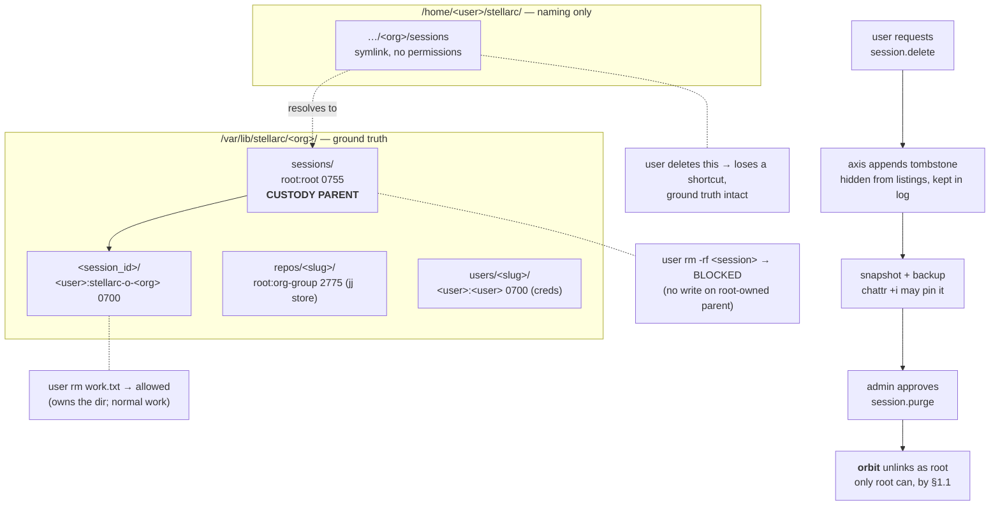

# ADR 0034 — Custodial Storage, Unix-Enforced Scoping, and Actor-Attributed Events

- Status: Proposed
- Date: 2026-07-26
- Relates to: ADR 0005 (org = hard boundary), 0012 (capability envelopes),
  0022 (human RBAC), 0024 (secret store), 0027 (sharing/BYOK), 0031 (install
  tiers, per-user Unix identities)
- Amends: ADR 0031 (§1 filesystem layout gains the custody rules below)

## 1. Decision

Three rules, one subject: **identity is the ground truth, and the kernel
enforces it.**

1. **Custodial storage.** Session and resource ground truth lives under the
   stellarc home (`/var/lib/stellarc/<org>/…` on system tier), never in a
   user's `$HOME`. The user's `$HOME` gets a *symlink* to it. A user deleting
   their `$HOME` pointer loses a shortcut, not data.
2. **Unix permissions are the access boundary; symlinks are naming only.**
   A symlink carries no permissions of its own and cannot be made read-only.
   Scoping comes from owner/group/mode on the real directories.
3. **Every event carries an actor.** Not optional. An event whose actor is
   unknown is precisely the event an audit needs.

### 1.1 Layout and custody

```text
/var/lib/stellarc/<org>/
├── sessions/                     root:root            0755   <- custody parent
│   └── <session_id>/             <user>:stellarc-o-<org> 0700 <- user's work
├── repos/<slug>/                 root:stellarc-o-<org> 2775  <- jj backing store
├── vaults/…                      root:stellarc-o-<org> 2770
└── users/<user_slug>/            <user>:<user>        0700   <- creds, leases

/home/<user>/stellarc/<org>/sessions -> /var/lib/stellarc/<org>/sessions
```

**The custody parent is the whole mechanism.** Unlinking a directory entry
requires write permission on the *parent*, not on the entry. With
`sessions/` owned `root:root 0755`, a user cannot `rm -rf` their own session
directory — the session record is structurally undeletable by them — while
still owning everything inside it. Verified on Linux/ext4:

| Action | Result |
|---|---|
| user `rm -rf sessions/<id>/` | **blocked** (no write on root-owned parent) |
| user `rm sessions/<id>/work.txt` | succeeds (owns the dir, normal work) |
| user deletes `$HOME` symlink | shortcut gone, ground truth intact |

No policy check, no daemon interposition, no path validation to get wrong.

### 1.5 Diagram



### 1.2 Deletion is a state machine, not an operation

4. Deletion is **soft by default and physical only by approval.** Two
   distinct authorities, following ADR 0012's additive-only model:
   - `session.delete` — request/tombstone. Grantable to the session owner.
   - `session.purge` — physical removal. Admin-only, never implied by
     ownership.

   Flow: user requests → axis appends a tombstone event (`deleted_at`, row
   hidden from normal listings, retained in the log) → snapshot/backup →
   admin approves → **orbit** performs the `rm` as root. An admin blocks
   simply by not advancing the state; there is no "cancel" path to race.

   This extends the pattern already implemented for projects
   (`Event::ProjectDeleted { deleted_at }`, `views/project.rs` filtering on
   `deleted_at.is_none()`, `WHERE deleted_at IS NULL` on reads). Sessions and
   repos adopt it rather than inventing a second scheme.
5. Only the orbit may perform a physical delete, because only root can unlink
   from the custody parent. Axis decides *whether*; orbit performs. Same
   split as the uid decision (ADR 0031 §3b.11).
6. During an approval window the snapshot MAY be pinned with the filesystem
   immutable attribute (`chattr +i`), which resists `rm` **even from root**
   (verified). Belt-and-braces for "wait until the backup is taken", not a
   substitute for rule 4.

### 1.3 Copy-on-write is a VCS concern, not a filesystem one

7. Resource attach uses **`jj workspace add`** — one backing store, a
   per-session working copy. Already implemented (`repos.rs::attach`,
   `sessions.rs::copy_jj_workspaces`). Do not add filesystem CoW:
   `cp --reflink` is unsupported on ext4 (verified on the dev host) and would
   silently degrade to full copies on the most common Linux filesystem, while
   jj is portable and yields history and conflict detection instead of just
   cheap bytes.
8. **Secrets are never symlinked.** Vault material and ADR 0024 leases
   materialize into the per-user `0700` runtime dir. A symlinked secret is
   readable by anyone who can resolve the path.

### 1.4 Actor attribution

9. The event envelope carries a **mandatory** actor: the authenticated
   principal, taken at the API boundary — never from a client-supplied field.
   `Option<actor>` is rejected: the unattributable event is the one that
   matters. (Precedent exists: `Event::JobDispatchIntent` already carries
   `initiating_principal`; session events do not, and
   `views/session.rs` still carries three `TODO(tenancy): carry
   orgId/ownerId/contextId` markers.)
10. On system tier the orbit additionally records the **resolved uid** it
    executed as. Divergence between actor and uid is an alarm, not a log
    line: it is exactly the identity-substitution failure ADR 0031 §3a.8
    describes, and it is otherwise silent.

## 2. Why

The product claim is *auditable per-human access to shared infrastructure* —
the answer to one `deploy@prod` key shared by six people, where the audit log
names the key, not the human. That claim rests entirely on two things being
true: work runs as a real per-human uid, and the log says who. Rule 9 is
therefore not plumbing; without it the rest is undemonstrable.

Custody exists because ground truth in `$HOME` is deletable by the person
being audited. A retention or legal-hold story cannot rest on the subject's
cooperation. Putting it under a root-owned parent is the cheapest mechanism
that removes their ability to destroy it while preserving normal file
ownership of their own work.

Symlinks were considered for scoping and rejected on measurement, not taste:
`chmod 0444` on a symlink **follows through and mutates the target**, so a
"per-session read-only" attempt silently changes shared org state, and two
users cannot hold different access to one resource through links.

## 3. Normative rules (summary)

| # | Rule |
|---|---|
| 1 | Ground truth under stellarc home; `$HOME` holds symlinks only |
| 2 | Access = owner/group/mode on real dirs; symlinks are naming |
| 3 | Custody parent `root:root 0755` over per-user `0700` session dirs |
| 4 | Soft delete default; `session.delete` ≠ `session.purge` |
| 5 | Only orbit physically deletes; axis only decides |
| 6 | `chattr +i` may pin a snapshot during approval |
| 7 | CoW via `jj workspace add`; no filesystem reflink dependency |
| 8 | Secrets materialize to per-user `0700`, never symlinked |
| 9 | Actor mandatory in the event envelope, from the authenticated principal |
| 10 | Orbit records resolved uid; actor≠uid is an alarm |

## 4. Migration order

1. **Actor in the event envelope** (rule 9) — additive, no tier work, unblocks
   the audit story on its own. Land first.
2. Session/repo tombstones reusing the project `deleted_at` pattern (rule 4),
   with `session.purge` as a separate capability id.
3. Custody permissions applied at session-space creation (rule 3). Requires
   the orbit to own materialization for non-local nodes — today
   `RepoStore`/`bridge_mgr` create directories from **axis**, which is correct
   only while axis and the node are the same host.
4. Resolved-uid recording + actor/uid divergence alarm (rule 10), after the
   ADR 0031 `spawn_as` seam exists.

## 5. Degradation on user tier

Rule 3 requires a parent the user does not control, so on user-tier nodes
custody is **best-effort**: the owner can delete their own tree. State this
in the product surface rather than implying a guarantee that isn't there. A
company that wants enforceable retention runs system tier — this is the
concrete reason to, beyond multi-user support.

## 6. Non-Linux

Rules 1, 2, 4, 7, 8, 9 are portable. Rule 3 depends on POSIX parent-directory
semantics (holds on macOS; Windows needs an ACL equivalent — deny-delete on
the container) and rule 6 on `chattr` (Linux-specific; macOS has
`chflags uchg`, Windows has no direct analogue). Per ADR 0031 §3c,
macOS/Windows remain user tier for now, where custody is best-effort anyway
(§5), so no equivalent is required until system tier lands there.

## 7. Rejected

- **Symlinked read-only resources** — a symlink has no mode of its own;
  `chmod` on it mutates the shared target (measured). Naming, not access.
- **Hardlinks for cheap sharing** — same inode, so writes mutate the original
  (measured). Not CoW and not isolation.
- **Filesystem CoW (`cp --reflink`, overlayfs) as the attach mechanism** —
  unsupported on ext4, silently degrades to full copy; jj already provides
  copy-on-write with semantics.
- **Read-only bind mounts as the general mechanism** — requires root
  (measured: `must be superuser`), so unavailable on user tier. Retained as
  optional hardening on system tier only.
- **Ground truth in `$HOME` with backup as the safety net** — makes retention
  depend on the audited party not running `rm`, and turns every deletion into
  a race against the backup window.
- **`Option<actor>` on events** — an unattributed event is the one an
  investigation needs; optionality guarantees it will be absent exactly then.
- **A stellarc-side permission layer over the filesystem** — reimplements
  what the kernel already enforces, and can be bypassed by any process
  reaching the path directly. ADR 0031 §2: policy is not a boundary.
